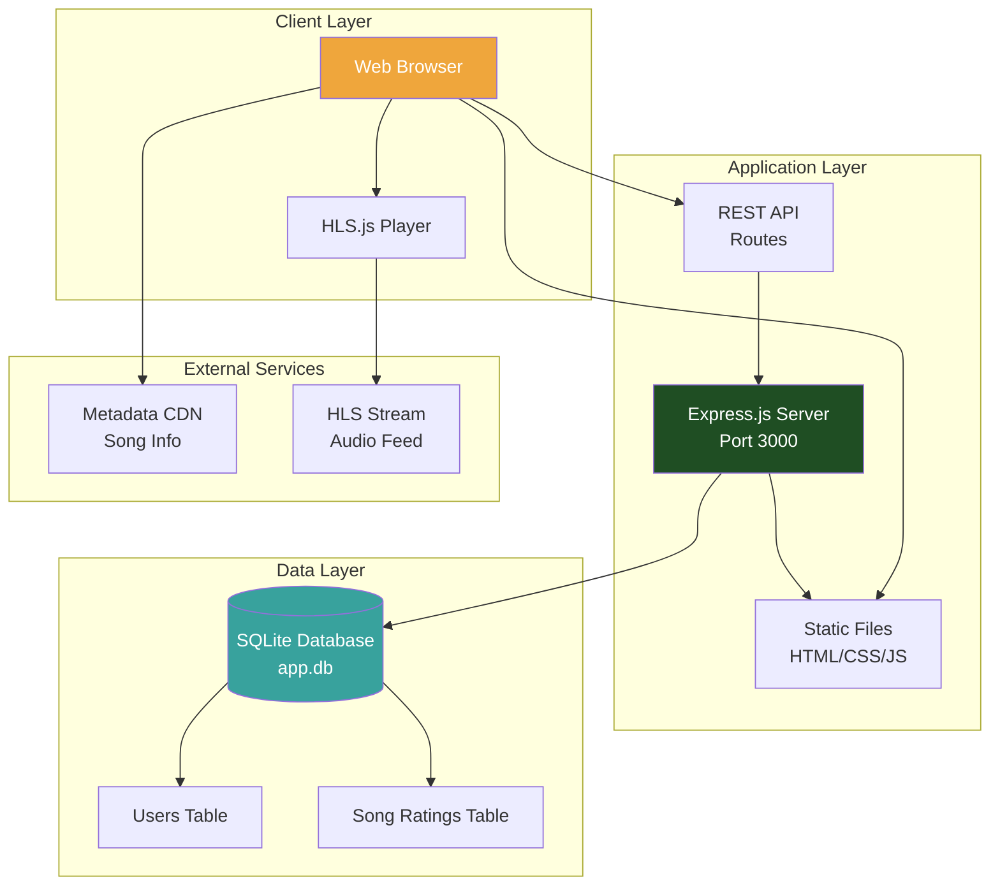
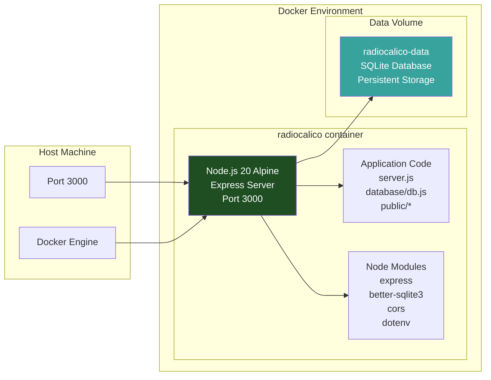
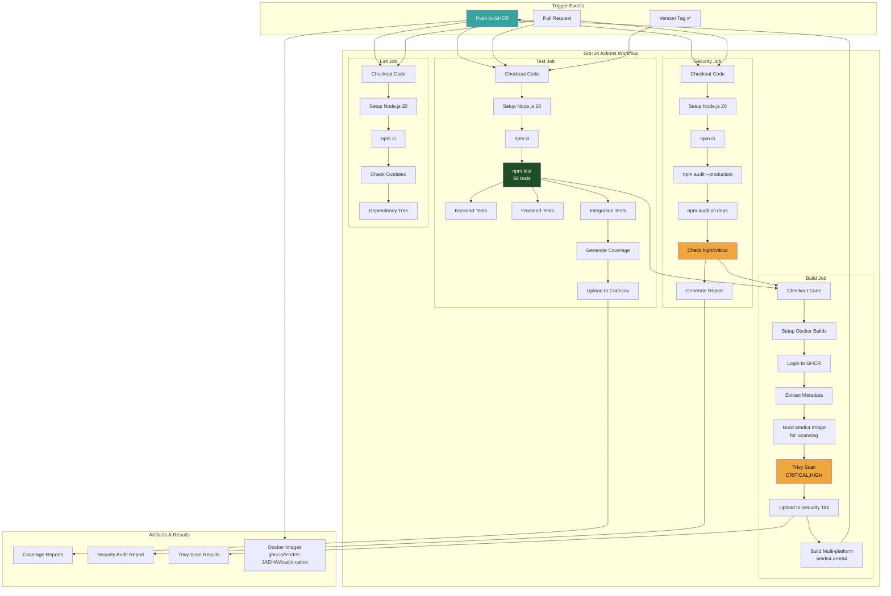
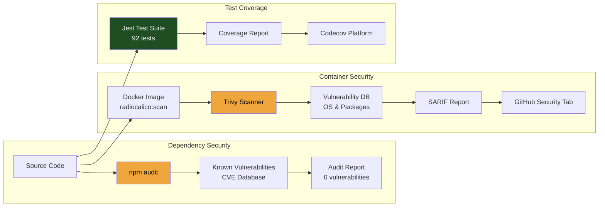
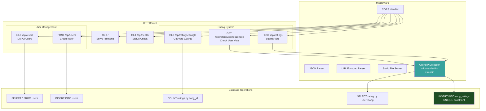
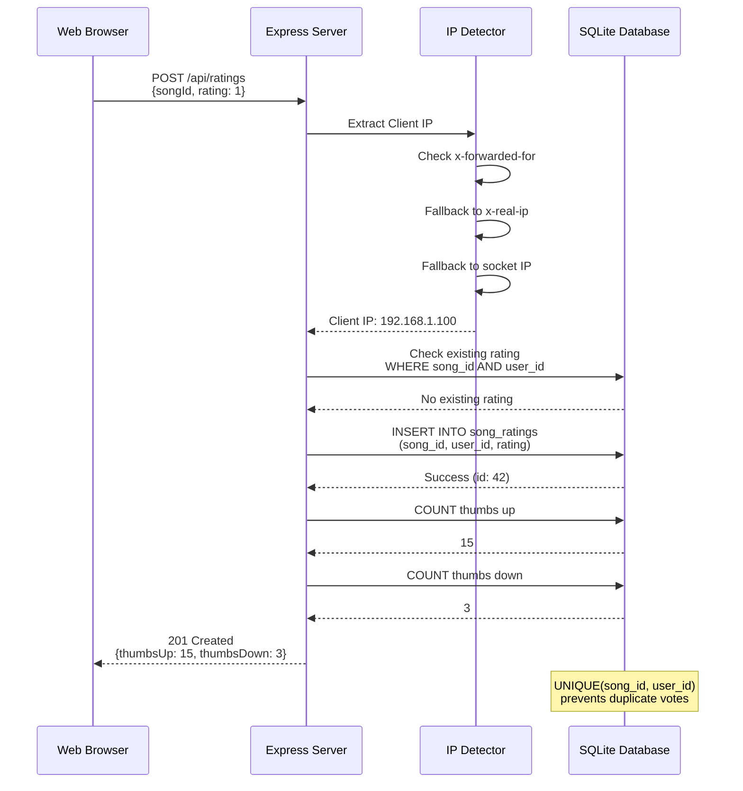
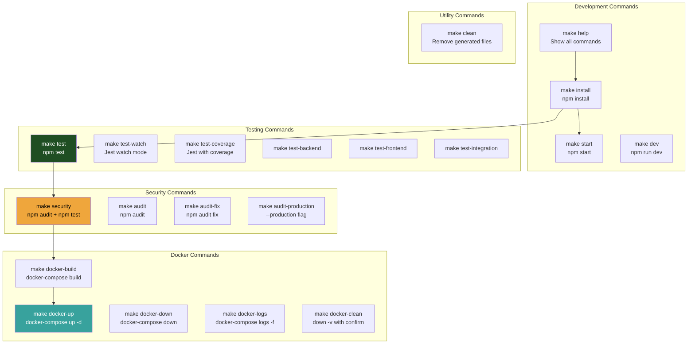
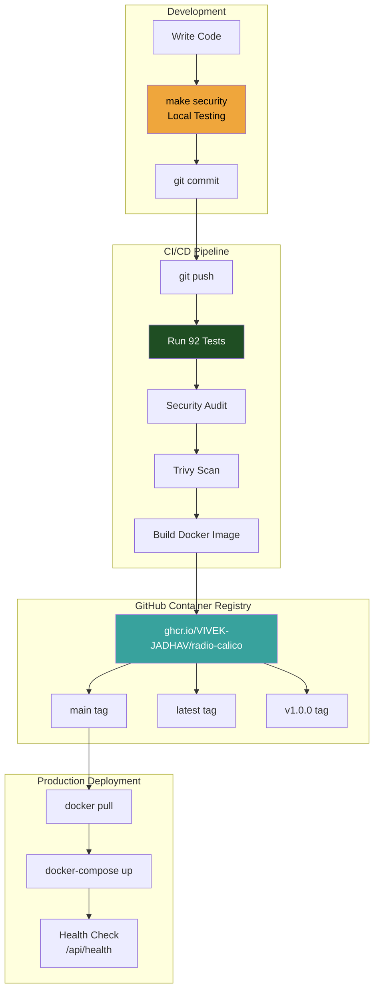
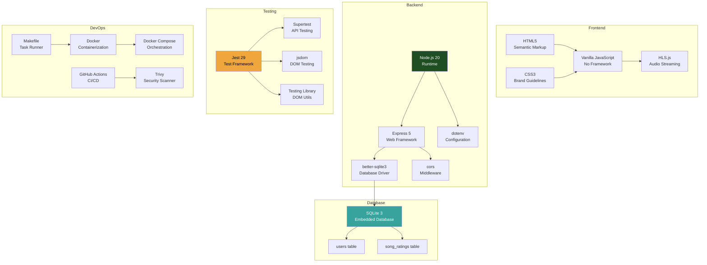

# Radio Calico System Architecture

## Application Architecture

## Docker Container Architecture

## CI/CD Pipeline Architecture

## Security Scanning Flow

## API Endpoint Architecture

## Data Flow: Song Rating

## Makefile Workflow

## Deployment Flow

## Technology Stack

---

## Architecture Principles

### 1. **Simplicity First**
- No heavy frontend frameworks (React, Vue, Angular)
- Vanilla JavaScript for maximum performance
- SQLite for zero-configuration database
- Single Express server for all routes

### 2. **Security by Default**
- IP-based user identification (privacy-friendly)
- UNIQUE constraints prevent duplicate votes
- npm audit on every build
- Trivy scans all Docker images
- CORS enabled for cross-origin protection

### 3. **Container-Ready**
- Multi-stage Docker builds (optimized size)
- Non-root user (security hardening)
- Health checks built-in
- Volume mounts for data persistence
- Multi-platform support (amd64, arm64)

### 4. **CI/CD Automation**
- Parallel job execution (test, security, lint)
- Automated testing on every commit
- Security scans block deployment on failures
- Multi-platform image builds
- Semantic versioning support

### 5. **Developer Experience**
- Makefile for common tasks
- Comprehensive test coverage (92 tests)
- Clear documentation (README, CLAUDE.md, DOCKER.md)
- Local development mirrors production
- Fast feedback loops (<2 minutes for tests)

## Scalability Considerations

### Current Limitations
- SQLite is single-writer (concurrent writes blocked)
- In-process database (doesn't scale horizontally)
- No caching layer (Redis, Memcached)
- No load balancing
- No CDN for static assets

### Future Enhancements (Not Implemented)
- PostgreSQL for multi-writer support
- nginx reverse proxy for SSL/TLS
- Redis for session storage and caching
- Horizontal scaling with Kubernetes
- CDN integration for static files
